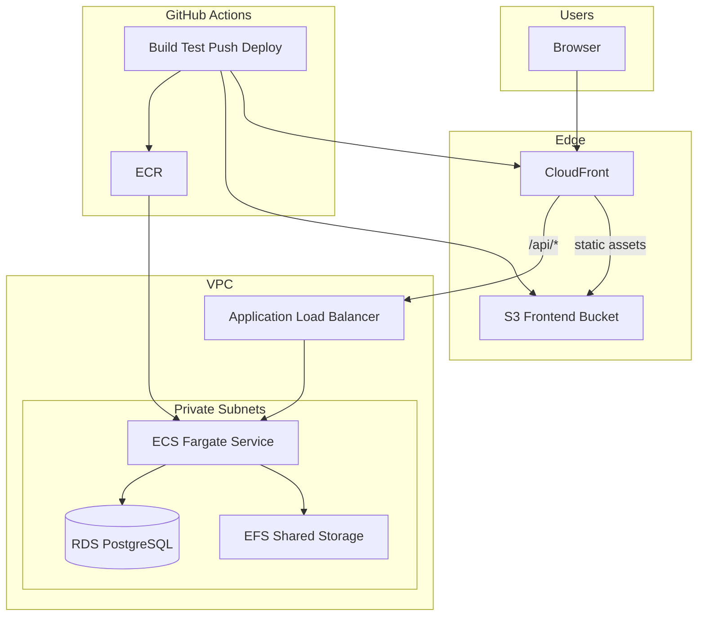
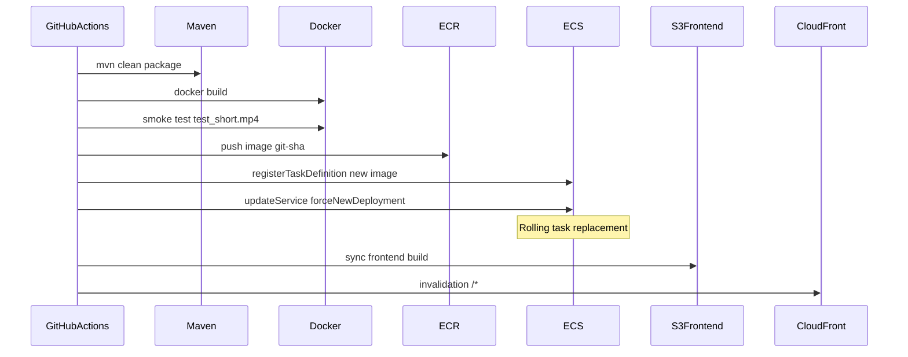

# AWS Deployment Specification (Goal Tier)

This document is the implementation-ready spec for deploying centroid-finder to a **single AWS environment** (`prod`). It supersedes the manual EC2/JAR flow in [`deploymentPlan.md`](../deploymentPlan.md) for Goal-tier work described in [`goals.md`](goals.md) (lines 33–38).

**Compute choice:** **Amazon ECS on Fargate** behind an Application Load Balancer. Your instructor’s ECS suggestion fits naturally here: the deploy unit is already a Docker image in ECR, and ECS replaces hand-rolled ASG user-data + `docker run` with a managed rolling deployment.

> **Goals.md mapping:** The original Goal bullet says “Auto Scaling Group behind an ALB.” With ECS Fargate, scaling is done via **ECS Service Auto Scaling** (task count), not an EC2 ASG. That satisfies the same intent (scale out under load, ALB in front). If your course requires a literal EC2 ASG, see [Appendix A: ECS on EC2](#appendix-a-ecs-on-ec2-alternative).

---

## 1. Architecture Overview

```
React (S3 + CloudFront)
        |
        |  /*           → S3 (static assets)
        |  /api/*       → ALB → ECS Fargate tasks
        v
   ECS Service (1–3 tasks)
        |        \
        v         v
   RDS (PostgreSQL)   EFS (/videos, /results)
        ^
        |
   ECR (Docker image: server.jar + processor.jar)
```



### Why ECS instead of raw ASG + Docker on EC2

| Concern | Raw ASG + user-data | ECS Fargate |
|---------|---------------------|-------------|
| Deploy new image | Instance refresh + SSM tag + user-data | Register task definition → `update-service` |
| Health / rollouts | Manual wiring | Built-in rolling deployment + circuit breaker |
| Scaling | EC2 ASG policies | ECS Service Auto Scaling on CPU or ALB metrics |
| Secrets injection | Shell script in user-data | Task definition `secrets` from Secrets Manager |
| Ops surface | Patch AMIs, Docker daemon, disk | AWS manages the runtime |

### Why EFS is still required

The app reads/writes videos and CSV results on the local filesystem (`VIDEOS_DIR`, `RESULTS_DIR`). With more than one ECS task behind the ALB, **EFS must be mounted into every task** so any task can read a video and serve a result file written by another task. Job metadata already lives in RDS.

S3-backed storage is a Stretch goal (requires application code changes).

---

## 2. Scope

### In scope (Goal tier)

| Goal (from `goals.md`) | Implementation |
|------------------------|----------------|
| Scale behind an ALB | ALB → ECS Fargate service (1–3 tasks) |
| Managed RDS for job metadata | PostgreSQL 16 in private subnets |
| GitHub Actions deploy to one environment | `.github/workflows/deploy.yml` on `main` |
| Env vars and secrets via GitHub + AWS | GitHub OIDC, Variables, Secrets; AWS Secrets Manager + task definition |
| Core infrastructure in Terraform | `terraform/environments/prod/` |

### Out of scope (Stretch / Impossible tiers)

- dev/stage/prod multi-environment
- Blue/green CodeDeploy or ECS CodeDeploy controller
- Redis caching
- Centralized observability (X-Ray, Datadog, etc.)
- S3 for video/result storage (without app rewrite)
- Secret rotation automation

### Defaults

| Setting | Value |
|---------|-------|
| Environment name | `prod` |
| AWS region | `us-east-1` (CloudFront ACM certs must be in `us-east-1`) |
| Frontend | External React repo; served from S3 + CloudFront |
| Launch type | **Fargate** |

---

## 3. Application Prerequisites

Complete these **before** first deploy.

### 3.1 Dockerfile

Both JARs live in one image. The server subprocess-spawns the processor JAR at a fixed path.

```dockerfile
# Recommended starting point — tune base image after JavaCV integration
FROM eclipse-temurin:21-jre-jammy

WORKDIR /app

COPY target/centroid-finder-1.0-SNAPSHOT.jar /app/server.jar
COPY target/centroid-finder-1.0-SNAPSHOT-jar-with-dependencies.jar /app/processor.jar

ENV VIDEOS_DIR=/app/videos \
    RESULTS_DIR=/app/results \
    VIDEO_PROCESSOR_JAR=/app/processor.jar

EXPOSE 8080
ENTRYPOINT ["java", "-jar", "/app/server.jar"]
```

- Add `.dockerignore` (exclude `videos/`, `results/`, `.git`, etc.).
- If JavaCV needs system FFmpeg: `RUN apt-get update && apt-get install -y ffmpeg` (verify against bundled natives first).
- Create empty mount points: `RUN mkdir -p /app/videos /app/results`.

### 3.2 Spring Boot Actuator (ALB health checks)

Add `spring-boot-starter-actuator` and expose:

```yaml
management:
  endpoints:
    web:
      exposure:
        include: health
  endpoint:
    health:
      probes:
        enabled: true
```

ALB health check path: **`/actuator/health`**.

### 3.3 Production profile

Add `application-prod.yml` with **no default DB credentials**. Set `SPRING_PROFILES_ACTIVE=prod` in the task definition.

Normalize database name to **`centroid_finder`** (matches `application.yml` default).

### 3.4 Other fixes

- **JavaCV migration** ([`goals.md`](goals.md) Easy tier) — blocking for container integration test that decodes `sampleInput/test_short.mp4`.
- **CLI invocation** — verify [`DefaultJobProcessLauncher`](../src/main/java/io/github/konradkelly/centroidfinder/DefaultJobProcessLauncher.java) args match `CliArgumentParser` before relying on async jobs in prod.

---

## 4. Network (Terraform module: `network`)

Single VPC, **2 Availability Zones** (ALB and RDS requirement).

| Subnet | Placement |
|--------|-----------|
| Public (×2 AZ) | ALB only |
| Private (×2 AZ) | ECS tasks, RDS, EFS mount targets |

**Egress:** Fargate tasks in private subnets need outbound access to ECR, Secrets Manager, and CloudWatch Logs. Options:

1. **Recommended for simplicity:** one NAT Gateway (~$32/mo + data).
2. **Cost-conscious:** VPC interface endpoints for `ecr.api`, `ecr.dkr`, `secretsmanager`, `logs`, plus S3 gateway endpoint (avoids NAT for ECR layers in S3).

### Security groups

| SG | Inbound | Outbound |
|----|---------|----------|
| `alb-sg` | 443 from `0.0.0.0/0` | → `ecs-sg:8080` |
| `ecs-sg` | 8080 from `alb-sg` | → `rds-sg:5432`, `efs-sg:2049`, HTTPS (443) for AWS APIs |
| `rds-sg` | 5432 from `ecs-sg` | — |
| `efs-sg` | 2049 from `ecs-sg` | — |

---

## 5. ECS (Terraform module: `ecs`)

### 5.1 Cluster

- Name: `centroid-prod`
- Fargate capacity providers only (default)

### 5.2 Task definition

| Setting | Value |
|---------|-------|
| Launch type | FARGATE |
| CPU / memory | **512 CPU (0.5 vCPU) / 1024 MiB** to start; bump to **1024/2048** if video jobs OOM or throttle |
| Network mode | `awsvpc` |
| Container name | `centroid-finder` |
| Container port | **8080** |
| Image | `{account}.dkr.ecr.{region}.amazonaws.com/centroid-finder:{tag}` |
| Logging | `awslogs` driver → `/ecs/centroid-prod` |

**Environment variables** (non-secret):

| Name | Value |
|------|-------|
| `VIDEOS_DIR` | `/app/videos` |
| `RESULTS_DIR` | `/app/results` |
| `VIDEO_PROCESSOR_JAR` | `/app/processor.jar` |
| `SPRING_PROFILES_ACTIVE` | `prod` |
| `SPRING_DATASOURCE_URL` | `jdbc:postgresql://{rds-endpoint}:5432/centroid_finder` |

**Secrets** (from Secrets Manager, injected by ECS — not plain env):

| Name | Secrets Manager key |
|------|----------------------|
| `SPRING_DATASOURCE_USERNAME` | `centroid/prod/rds:username` |
| `SPRING_DATASOURCE_PASSWORD` | `centroid/prod/rds:password` |

**EFS volume** (required for multi-task):

```hcl
# Conceptual — one EFS file system, two access points or subpaths
volume {
  name = "shared-data"
  efs_volume_configuration {
    file_system_id     = aws_efs_file_system.main.id
    transit_encryption = "ENABLED"
    authorization_config {
      access_point_id = aws_efs_access_point.app.id
      iam             = "ENABLED"
    }
  }
}

# Mount twice via mountPoints in container definition
# sourceVolume shared-data → containerPath /app/videos  (EFS /videos AP root)
# sourceVolume shared-data → use a second volume/AP for /app/results
```

Use **two EFS access points** (`/videos`, `/results`) mounted at `/app/videos` and `/app/results`.

### 5.3 ECS service

| Setting | Value |
|---------|-------|
| Desired count | **1** |
| Deployment | Rolling; `minimumHealthyPercent=100`, `maximumPercent=200` |
| Deployment circuit breaker | **Enabled** with rollback |
| Load balancer | Attach to ALB target group (see §6) |
| Subnets | Private subnets only |
| Assign public IP | **false** |
| Health check grace period | **120s** (Spring Boot + JVM startup) |

### 5.4 Service Auto Scaling (replaces EC2 ASG scaling)

Register scalable target on `ecs:service:DesiredCount`.

| Policy | Setting |
|--------|---------|
| Type | Target tracking |
| Metric | `ECSServiceAverageCPUUtilization` |
| Target | **70%** |
| Min capacity | **1** |
| Max capacity | **3** |

Optional second policy: ALB `RequestCountPerTarget` if CPU is too laggy for HTTP-heavy workloads.

### 5.5 IAM roles

**Task execution role** (`ecsTaskExecutionRole`):

- `AmazonECSTaskExecutionRolePolicy` (ECR pull, logs)
- Inline: `secretsmanager:GetSecretValue` on RDS secret
- Inline: EFS client mount permissions for the access points

**Task role** (`centroidTaskRole`):

- Minimal for now (no S3/AWS SDK in app)
- Add permissions here if you later integrate S3 or Secrets Manager from Java code

**GitHub Actions deploy role** (separate): ECR push, `ecs:RegisterTaskDefinition`, `ecs:UpdateService`, `ecs:DescribeServices`, S3 frontend sync, CloudFront invalidation, Terraform state (if CI applies TF).

---

## 6. Load Balancer (Terraform module: `alb`)

| Setting | Value |
|---------|-------|
| Type | Application, internet-facing |
| Subnets | Public |
| Listeners | HTTPS (ACM cert) → forward; HTTP → redirect 301 |
| Target group protocol | HTTP |
| Target group port | 8080 |
| Target type | **`ip`** (required for Fargate awsvpc) |
| Health check path | `/actuator/health` |
| Health check interval | 30s |
| Healthy / unhealthy threshold | 2 / 3 |
| Idle timeout | **120s** |
| Stickiness | Disabled (RDS + EFS handle shared state) |

CloudFront `/api/*` origin → **ALB DNS name** (HTTPS-only custom origin).

---

## 7. Database (Terraform module: `rds`)

| Setting | Value |
|---------|-------|
| Engine | PostgreSQL **16** |
| Instance class | `db.t3.micro` |
| Allocated storage | 20 GB gp3 |
| DB name | `centroid_finder` |
| Multi-AZ | No (cost control) |
| Publicly accessible | **No** |
| Backup retention | 7 days |
| Credentials | `random_password` → **Secrets Manager** secret `centroid/prod/rds` |

Schema: Hibernate `ddl-auto: update` initially. Plan Flyway for later.

---

## 8. Shared Storage (Terraform module: `efs`)

| Setting | Value |
|---------|-------|
| Encryption | Enabled |
| Mount targets | One per private subnet / AZ |
| Access point `/videos` | POSIX root `/videos`, uid/gid 1000 |
| Access point `/results` | POSIX root `/results`, uid/gid 1000 |
| IAM authorization | Enabled (task role must allow mount) |

**Seed videos:** one-time copy into EFS (e.g. `aws efs-utils` mount from a bastion/SSM session, or sync from S3 staging bucket in CI).

---

## 9. Container Registry (Terraform module: `ecr`)

| Setting | Value |
|---------|-------|
| Repository | `centroid-finder` |
| Scan on push | Enabled |
| Lifecycle | Retain last **10** images |

Image tags: **`{git-sha}`** (immutable). `:latest` optional for local dev only.

---

## 10. Frontend (Terraform module: `frontend`)

Same pattern as [`deploymentPlan.md`](../deploymentPlan.md), with the API origin pointing at the **ALB** (not EC2).

| Resource | Config |
|----------|--------|
| S3 bucket | Private; block all public access |
| CloudFront OAC | S3 read via bucket policy |
| Origin 1 | S3 (static site) |
| Origin 2 | ALB HTTPS |
| Behavior `/api/*` | ALB origin, caching disabled |
| Default behavior `/*` | S3, cached |
| SPA routing | 403/404 → `/index.html` (200) |
| ACM | `us-east-1` for CloudFront custom domain |

Frontend build: `VITE_API_BASE=/api` (same-origin through CloudFront — no CORS in Spring).

---

## 11. Secrets and Configuration Matrix

| Name | Where | Used by |
|------|-------|---------|
| `AWS_ROLE_ARN` | GitHub Secret | GHA OIDC assume-role |
| `AWS_REGION` | GitHub Variable | GHA, Terraform |
| `ECR_REPOSITORY` | GitHub Variable / TF output | Docker push |
| `ECS_CLUSTER` | GitHub Variable / TF output | Deploy workflow |
| `ECS_SERVICE` | GitHub Variable / TF output | Deploy workflow |
| `ECS_TASK_FAMILY` | GitHub Variable / TF output | Register task definition |
| `CF_DISTRIBUTION_ID` | GitHub Secret | CloudFront invalidation |
| RDS credentials | Secrets Manager `centroid/prod/rds` | ECS task definition `secrets` |
| `TF_STATE_BUCKET`, `TF_LOCK_TABLE` | GitHub Secrets | Terraform remote state |

**No long-lived `AWS_ACCESS_KEY_ID` in GitHub.** Use OIDC:

```yaml
permissions:
  id-token: write
  contents: read

- uses: aws-actions/configure-aws-credentials@v4
  with:
    role-to-assume: ${{ secrets.AWS_ROLE_ARN }}
    aws-region: ${{ vars.AWS_REGION }}
```

Trust policy: restrict to your repo and `refs/heads/main`.

---

## 12. Terraform Layout

```
terraform/
  bootstrap/              # One-time: S3 state bucket + DynamoDB lock table
  modules/
    network/
    alb/
    ecs/                  # cluster, task definition, service, auto scaling, IAM
    rds/
    efs/
    ecr/
    frontend/
    github-oidc/
  environments/
    prod/
      main.tf
      variables.tf
      outputs.tf
      terraform.tfvars
      backend.tf
```

**Key outputs:** CloudFront domain, ALB DNS, ECR repository URL, ECS cluster/service names, RDS endpoint (sensitive), frontend bucket name.

Secrets never go in `terraform.tfvars`. Generate RDS password with `random_password` and store in Secrets Manager.

---

## 13. CI/CD

### 13.1 Existing CI

[`.github/workflows/run-tests.yml`](../.github/workflows/run-tests.yml) — unchanged for PRs and pushes (unit + integration tests).

### 13.2 New deploy workflow (`.github/workflows/deploy.yml`)

Trigger: push to `main` after CI passes (use `workflow_run` or a single pipeline with a `deploy` job that `needs: [unit-tests, integration-tests]`).



**Backend deploy steps:**

1. `mvn -B package`
2. `docker build -t $ECR_URI:$GITHUB_SHA .`
3. **Container smoke test** — run container with Postgres service; mount test video; hit `POST /process/...`; assert CSV in `RESULTS_DIR`
4. `docker push $ECR_URI:$GITHUB_SHA`
5. Render new task definition JSON (or use `amazon-ecs-render-task-definition` action) with updated image tag
6. `aws ecs register-task-definition ...`
7. `aws ecs update-service --cluster ... --service ... --task-definition ... --force-new-deployment`
8. Wait until `deployments[0].rolloutState == COMPLETED` and circuit breaker has not rolled back

**Frontend deploy steps** (same workflow or separate job):

1. Checkout frontend repo
2. `npm ci && npm run build`
3. `aws s3 sync dist/ s3://$FRONTEND_BUCKET --delete`
4. `aws cloudfront create-invalidation --distribution-id $CF_DIST_ID --paths "/*"`

**Post-deploy smoke:** `curl -sf https://$CLOUDFRONT_DOMAIN/api/videos`

### 13.3 Rollback

1. Re-register previous task definition revision (or re-point to prior image tag)
2. `update-service --force-new-deployment`
3. ECS circuit breaker may auto-rollback if new tasks fail health checks
4. Frontend: restore prior S3 object versions or re-sync previous build artifact

---

## 14. Cost Estimate (us-east-1, rough monthly)

| Resource | ~Cost |
|----------|-------|
| ALB | $16–22 |
| Fargate 0.5 vCPU / 1 GB × 1 task | $18–25 |
| RDS db.t3.micro | $13 |
| EFS (minimal) | $3–10 |
| NAT Gateway | $32 + data (or ~$7/mo with VPC endpoints instead) |
| CloudFront + S3 | $1–5 |
| Secrets Manager | ~$0.40/secret |
| **Total** | **~$85–110/mo** with NAT; **~$55–70/mo** with endpoints |

Scale-out to 3 tasks adds Fargate cost proportionally.

---

## 15. Acceptance Criteria

- [ ] `terraform apply` succeeds after bootstrap
- [ ] ECS service stable; ALB target group **healthy**
- [ ] `GET https://<cloudfront>/api/videos` returns JSON from EFS-backed catalog
- [ ] `POST /process/{file}?targetColor=FF0000&threshold=100` → `202` + `jobId`
- [ ] Poll to `done`; CSV fetchable at `/results/**`
- [ ] Push to `main` deploys new image; running task uses new `GITHUB_SHA` tag
- [ ] Scale-out test: load triggers second task (or manual `desiredCount=2`)
- [ ] RDS not reachable from the public internet

---

## 16. Implementation Phases

1. **App hardening** — Dockerfile, Actuator, prod profile, JavaCV, CLI fix
2. **Terraform bootstrap** — remote state bucket + lock table
3. **Core infra** — VPC, RDS, EFS, ECR, ECS cluster (no service yet)
4. **Manual task run** — one-off Fargate task or local Docker against RDS to validate connectivity
5. **ALB + ECS service** — wire target group, verify `/actuator/health`
6. **GitHub OIDC + deploy workflow** — backend only
7. **Frontend** — S3 + CloudFront + deploy job
8. **Teardown runbook** — `terraform destroy` order (ECS → ALB → RDS snapshot decision)

---

## Appendix A: ECS on EC2 (Alternative)

Use this if the course rubric requires a literal **EC2 Auto Scaling Group**:

- Create an ECS cluster with an **EC2 capacity provider** backed by an ASG (`t3.small`, min 1 / max 3).
- Install the ECS agent via Amazon Linux 2023 ECS-optimized AMI (no custom user-data Docker install).
- Task definition uses **`launch_type = EC2`** or capacity provider strategy; EFS mounts work the same.
- ALB target type can be **`instance`** (bridge/host mode) or **`ip`** (awsvpc on EC2).
- Deploy still via `register-task-definition` + `update-service`; ASG scales **EC2 capacity**, ECS scales **task count** on that capacity.

This is more moving parts than Fargate but maps directly to “ASG behind ALB” wording in `goals.md`.

---

## Appendix B: Related Documents

| Document | Purpose |
|----------|---------|
| [`goals.md`](goals.md) | Project tier definitions |
| [`deploymentPlan.md`](../deploymentPlan.md) | Original Easy-tier manual plan (EC2 + JAR) |
| [`application.yml`](../src/main/resources/application.yml) | Runtime config defaults |
| [`.github/workflows/run-tests.yml`](../.github/workflows/run-tests.yml) | CI pipeline |
